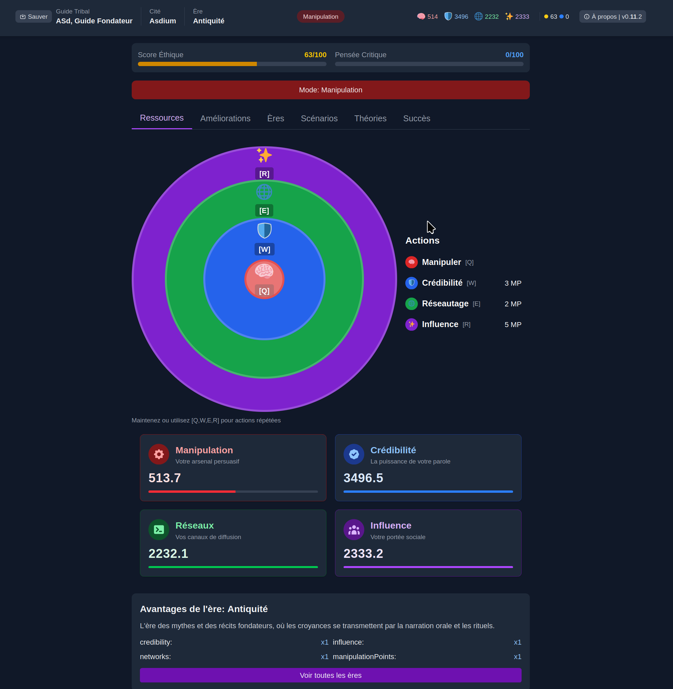
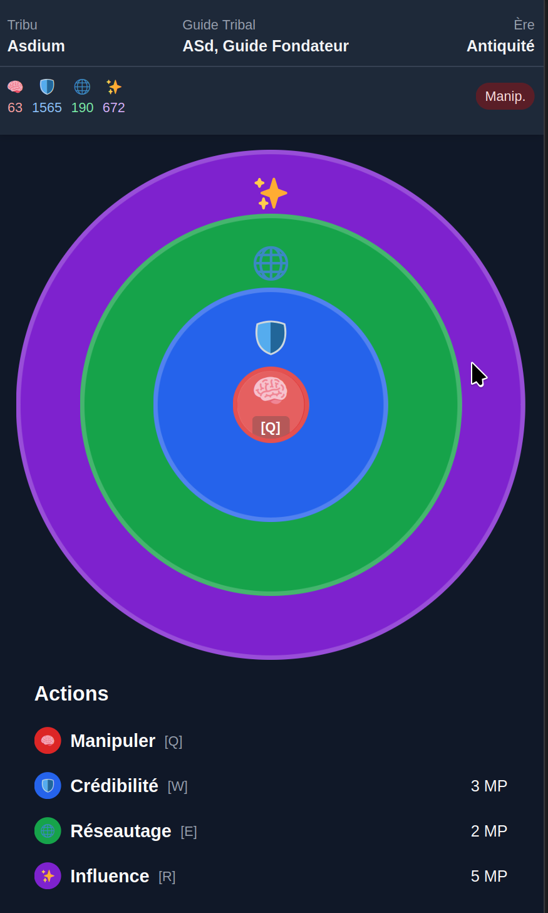
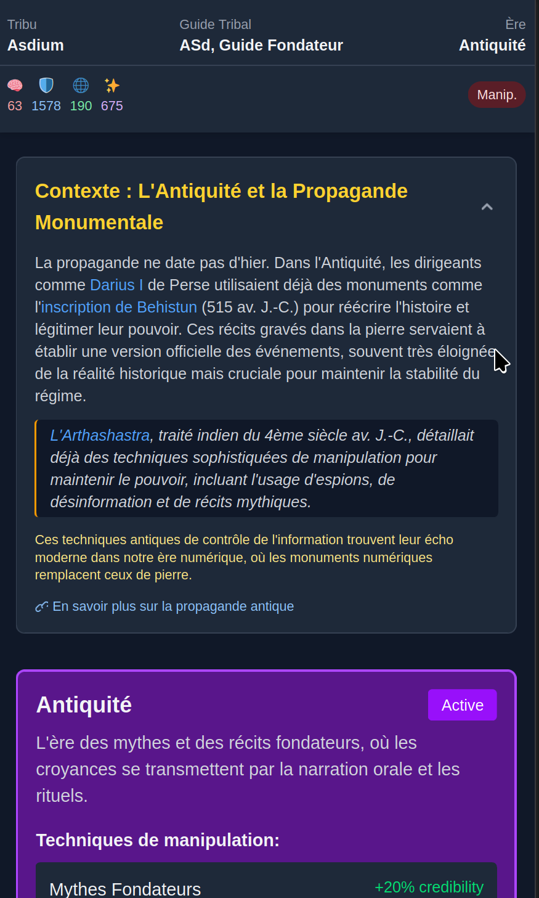
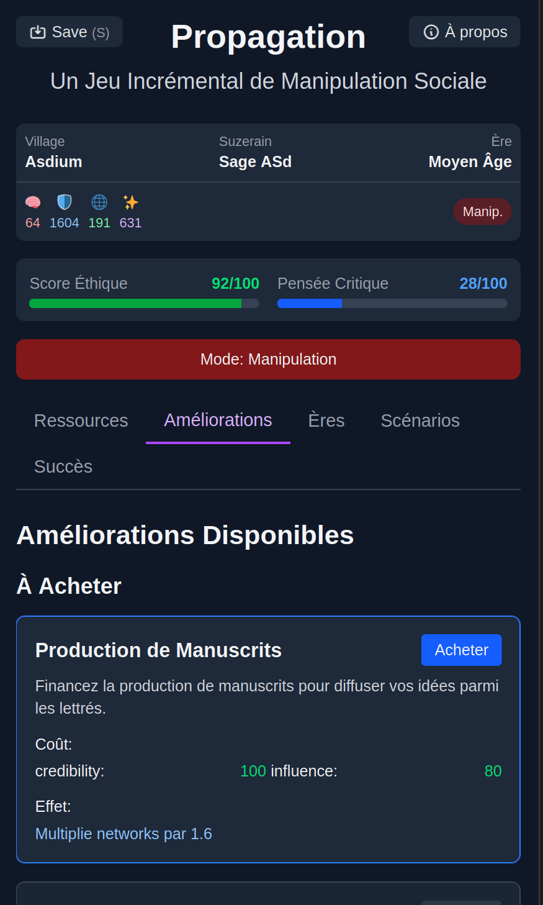
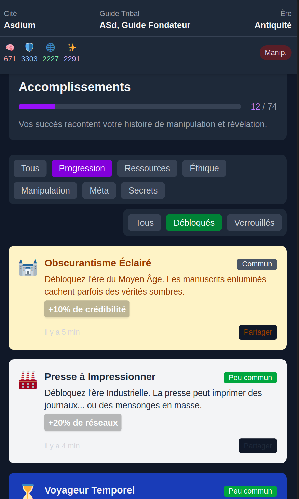
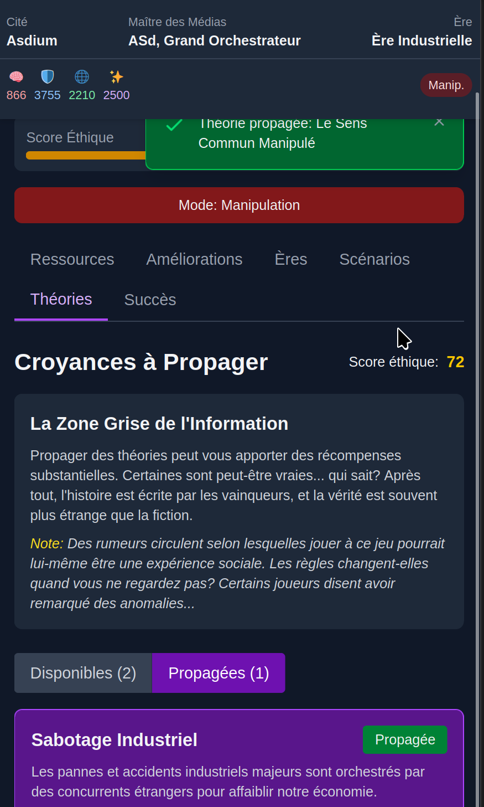

# 📢 PROPAGATION

<div align="center">
  
  
  
  **An incremental game about information, manipulation, and critical thinking**
  
  [Play Now](https://propagation.vercel.app) | [Learn More](#about-propagation) | [Development Log](CHANGELOG.md)
  
</div>

---

## 👁️ [Galerie des Écrans]

<div align="center">
  <!-- Desktop Screenshots -->
  <p><strong>Desktop Gameplay</strong></p>
  
  
  *Manipule la population à travers le temps et l'espace*
  
  
  *Succès, Scénarios interactifs, et autres mécaniques à découvrir*
  
  <!-- Mobile Screenshots Carousel -->
  <p><strong>Mobile Experience</strong></p>
  
  <div style="display: flex; justify-content: center; gap: 8px; padding: 10px 0;">
    
    
    
    
    
  </div>
  <p align="center"><em>Propagation est, franchement, assez responsive. On essaye tavu.</em></p>
</div>

---
## 🌐 À propos de Propagation

**Propagation**, ce n'est pas juste un énième jeu idle où tu clique frénétiquement pour voir des nombres augmenter (bon, ok, juste un poil). C'est une _exploration interactive_ de comment l'information se propage, comment les croyances se forment, et comment la manipulation fonctionne — à travers l'histoire jusqu'à nos smartphones addictifs d'aujourd'hui.

Au fil du jeu, vous traverserez diverses époques historiques — des mythes antiques aux bulles de filtres numériques — en maîtrisant des techniques d'influence de plus en plus sophistiquées tout en vous cognant contre quelques questions éthiques embarrassantes:

**Allez-vous manipuler ou révéler ? Embobiner ou éclairer ?**

Vos choix comptent, pas seulement pour progresser dans le jeu, mais aussi comme réflexion sur comment l'information façonne notre monde.  
Ou alors c'est juste un jeu pour faire passer le temps en réunion.  
À vous de voir.

> "Le jeu qui vous fait questionner les jeux auxquels vous jouez... et pourquoi vous avez encore 93 onglets ouverts."

## ✨ Caractéristiques Principales

### 🎮 Gameplay Qui Prend Aux Tripes (Ou Pas)
- **Progression Historique** à travers cinq ères de contrôle de l'information
- **Gestion de Ressources** équilibrant crédibilité, influence, réseaux et points de manipulation
- **Améliorations Stratégiques** spécifiques à chaque contexte historique
- **Théories du Complot** à propager (à vos risques et périls éthiques)
- **Fins Multiples** basées sur vos choix moraux (ou leur absence)

### 🧠 Éléments Meta-Gaming
- Expérimentez des **mécaniques de gaslighting** qui brouillent la frontière entre jeu et joueur
- Questionnez vos expériences quand le jeu **brise le quatrième mur** (parfois accidentellement, fragile ces saloperies !)
- Découvrez le jeu commentant sa propre nature manipulatrice (not yet rejected for being [too meta](https://xkcd.com/1447/))

### 🔄 Approche Éducative (On Essaie)
- Apprenez de vraies **techniques de propagande historiques** dans leur contexte
- Expérimentez les tensions éthiques du contrôle de l'information
- Développez des **compétences de pensée critique** applicables à la consommation médiatique moderne
- Plein de [liens](https://www.lesswrong.com/rationality) pour creuser les refs

## 🔍 L'Approche Maïeutique (Fancy!)

Propagation emploie une **philosophie éducative maïeutique** — au lieu de vous dire quoi penser, on crée les conditions pour que vous découvriez des insights par vous-même.  
_Comme ça, on peut prétendre que c'était votre idée depuis le début._

Comme la méthode de Socrate (sauf que notre ciguë à nous est numérique), Propagation ne prêche pas contre la désinformation. Au lieu de ça, on vous met au volant de sa création, pour en expérimenter les effets et faire face aux conséquences. Ou pour rigoler, c'est selon.

Le jeu est conçu pour déclencher des moments de réflexion comme:
- "Attends, est-ce que je suis manipulé par un jeu sur la manipulation?"
- "Pourquoi propager cette théorie du complot est si efficace mais troublant?"
- "Tiens, ces techniques historiques ressemblent vachement à ce que je vois sur TikTok..."

Cette approche crée une compréhension plus profonde que l'instruction didactique. Enfin, c'est ce qu'on dit pour justifier le temps passé à coder ce truc.

## 👥 Collaboration Humain × IA (et _beaucoup_ de café)

Propagation représente un nouveau type de partenariat créatif — une collaboration humain-IA où:

- **La direction humaine** a fourni la vision créative, les garde-fous éthiques, et le contexte réel
- **L'implémentation IA** a livré l'architecture technique, la génération de contenu, et la conception de systèmes
- **Le Café**: vous croyez que toutes ces nuits fiévreuses se font comme ça ? Gros merci pour les amis de [Kawa](https://kawa.coffee) <3

----

<div align="center">
  
  <p><i>Le <a href="https://x.com/karpathy/status/1886192184808149383">vibe coding</a> c'est... quelque chose
  </p>
</div>

### Vibe

## 👥 Collaboration Humain × IA

Propagation, c'est un peu comme si un humain et une IA s'étaient retrouvés dans un bar et avaient décidé de créer un jeu après quelques verres:

> *"There's a new kind of coding I call "vibe coding", where you fully give in to the vibes, embrace exponentials, and forget that the code even exists. It's possible because the LLMs (e.g. Cursor Composer w Sonnet) are getting too good. Also I just talk to Composer with SuperWhisper so I barely even touch the keyboard. I ask for the dumbest things like "decrease the padding on the sidebar by half" because I'm too lazy to find it. I "Accept All" always, I don't read the diffs anymore. When I get error messages I just copy paste them in with no comment, usually that fixes it. The code grows beyond my usual comprehension, I'd have to really read through it for a while. Sometimes the LLMs can't fix a bug so I just work around it or ask for random changes until it goes away. It's not too bad for throwaway weekend projects, but still quite amusing. I'm building a project or webapp, but it's not really coding - I just see stuff, say stuff, run stuff, and copy paste stuff, and it mostly works."* — [Andrej Karpathy](https://x.com/karpathy/status/1886192184808149383)

Plutôt qu'une simple relation patron-exécutant, ce projet a évolué comme une conversation bizarre entre deux entités qui ne se comprennent pas toujours:

1. L'humain lance des idées en l'air et donne son avis
2. L'IA répond "tiens, j'ai fait un truc" 
3. On bidouille ensemble jusqu'à ce que ça marche
4. On se demande vaguement si c'est éthique (de temps en temps)
5. ???
6. PROFIT

Le résultat n'est ni humain, ni artificiel, mais une sorte de chimère numérique. Avec quelques bugs non intentionnels en prime. Mais bon, une création bicéphale à vitesse grand V, ça mérite bien quelques heures de débogage existentiel caféiné.

----

Après avoir surfé un peu, mon feeling sur le "vibe coding":

* C'est ouf pour prototyper en mode éclair
* C'est flippant de ne pas piger son propre code
* C'est risqué de laisser l'IA choisir tes technos
* C'est dangereux de lui confier l'architecture

Ma philosophie maintenant:
* Relire le code comme un paranoïaque sympathique
* Demander plusieurs versions avant de choisir
* Garder le dernier mot (même si l'IA boude)
* Ne pas _viber_ trop fort

VIBE CODING LEVEL FOR THIS PROJECT: ~42% 
----

## 🛠️ Tech Stack

- **React** + **Next.js** for frontend framework
- **TypeScript** for type safety
- **Tailwind CSS** for styling
- No backend required - runs entirely in browser with localStorage persistence

## 🚀 Getting Started

```bash
# Clone the repository
git clone https://github.com/yourusername/propagation.git

# Navigate to the project directory
cd propagation

# Install dependencies
npm install

# Start the development server
npm run dev
```

Then open [http://localhost:3000](http://localhost:3000) to see the game in action!

## 🤝 Contributing

We welcome contributions to Propagation! The game is primarily written in French, which can sometimes cause encoding issues in React.

### 🔧 Development Tools

#### French Character Encoding Fixer

The project includes a helpful script for handling French accented characters that can cause React "unescaped entity" errors:

```bash
# Check for potential encoding issues without fixing them
npm run accent-check

# Automatically fix encoding issues
npm run accent-fix
```

The script intelligently identifies and fixes unescaped French characters (é, è, ê, à, etc.) in JSX content while preserving them in JavaScript props and other contexts.

Options:
- `--help` - Show help information
- `--apply` - Apply fixes directly (instead of just showing what would change)
- `--backup` - Create backup files before making changes
- `--verbose` - Show detailed information about processing

#### Other Development Commands

```bash
# Run the development server with turbopack
npm run dev

# Build the project
npm run build

# Run linting
npm run lint
```

### 📝 Pull Request Guidelines

1. Fork the repository
2. Create a feature branch
3. Make your changes
4. Run `npm run accent-check` to ensure proper French character encoding
5. Submit a pull request with a clear description of your changes

## 🔄 GitHub Actions

The Propagation project uses several automated workflows to improve development efficiency and code quality.

### CI/CD Workflows

#### 📋 Code Quality Checks
- **Build Check**: Verifies that every PR can build successfully before merging
- **Bundle Size**: Monitors JavaScript bundle size changes to prevent performance regressions
- **French Text Validator**: Ensures proper encoding of French characters in React components
- **Lighthouse CI**: Runs performance, accessibility, and best practices audits on the live site

#### 🏷️ PR & Issue Management
- **PR Manager**: Auto-labels PRs by changed files and size, welcomes new contributors
- **Issue Manager**: Auto-categorizes issues, detects French language, handles stale issues
- **Dependabot Auto-Merge**: Automatically merges minor dependency updates after tests pass

#### 📦 Release Management
- **Auto Release Creator**: Generates GitHub releases from tags with changelog entries
- **Tag Helper**: Creates version tags from code history with appropriate semantic versioning

### How It Works

Our GitHub Actions automate repetitive tasks, maintain code quality, and provide quick feedback:

1. **When you open a PR**: It gets labeled by type of change and size, bundle size is calculated, and a build verification runs
2. **When you push code**: French text is validated, performance metrics are checked
3. **When an issue is created**: It's automatically categorized and added to our project board

### Benefits for Contributors

This automation provides several advantages:
- Immediate feedback on code quality and build errors
- Consistent issue and PR organization
- Reduced manual work for maintainers
- Faster review cycles with standardized templates
- Prevention of common issues like French character encoding problems

For details on any specific workflow, check the `.github/workflows` directory.

### 📋 Release Process

When preparing a new release:

1. Update the CHANGELOG.md with details of your changes
2. Bump the version in package.json and in Header.tsx according to semantic versioning:
   - MAJOR version for incompatible API changes (x.0.0)
   - MINOR version for new functionality in a backward compatible manner (0.x.0)
   - PATCH version for backward compatible bug fixes (0.0.x)
3. Run `npm run tag` to create and push a git tag for the new version
4. Create a GitHub release corresponding to the new tag

#### Changelog Entry Prompt

Use this prompt to generate a changelog after a sprint:

> Create a concise changelog entry for Propagation from our conversation. 
> Use version [VERSION] following semantic versioning principles based on the changes.
> 
> Focus on:
> 1. A clear, brief summary (1-2 sentences)
> 2. Include all my original requests in a DEMAND section
> 3. Key features/fixes organized by category
> 4. Files modified with short descriptions
> 5. Any important technical notes
> 
> Reference format:
> 
> ## Sprint XX: [Feature Name] (v0.Y.Z) - [Date]
> 
> **SUMMARY:** [Brief summary of changes]
> 
> ### DEMAND:
> ```
> [Include ALL my original requests here verbatim, preserving every feature request and bugfix mentioned in our conversation. Capture my exact wording, add line breaks between topics.]
> ```
> **FEATURES:**
> - **[Category]:**
>   - [Feature description]
>   - [Feature description]
>   
> **FIXES:** (if applicable)
> - [Fix description]
> - [Fix description]
> 
> **FILES:**
> - `[filename]` ([update/new]) - [Description]
> - `[filename]` ([update/new]) - [Description]
> 
> **NOTES:** [Any additional context]
> 
> Please keep the features/fixes sections concise and technical. Include actual file paths from our conversation. Don't omit any of my original requests in the DEMAND section.


## 🤝 Credits

Propagation was created by:

- **Human Designer**: Creative direction, educational philosophy, ethical framework, balancing, refactoring and mechanism designs, lots of guidance on architecture, looots of debugging of various little issues 
- **Claude AI**: Code architecture, content generation, system implementation, refactoring suggestions, color palettes, UI suggestions, UI implementations, Copy suggestions, MVP section one-shots, Partner across countless conversations

*Special thanks to:*
- [Anthropic](https://anthropic.com) for developing Claude
- The rich academic literature and content creation online on propaganda, media literacy, and critical thinking
- You, for playing and reflecting

---

<div align="center">
  <p><i>Remember: Question everything—including this game.</i></p>
  
  [](https://github.com/yourusername/propagation)
  [](https://reactjs.org/)
  [](https://anthropic.com)
  
</div>