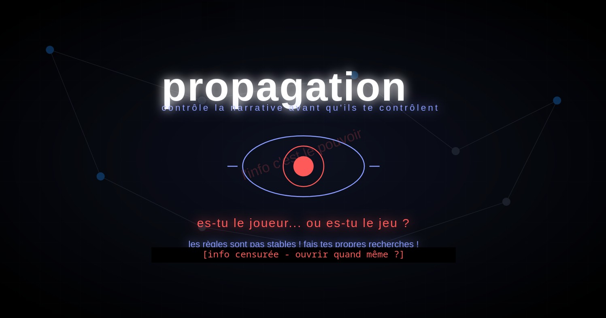
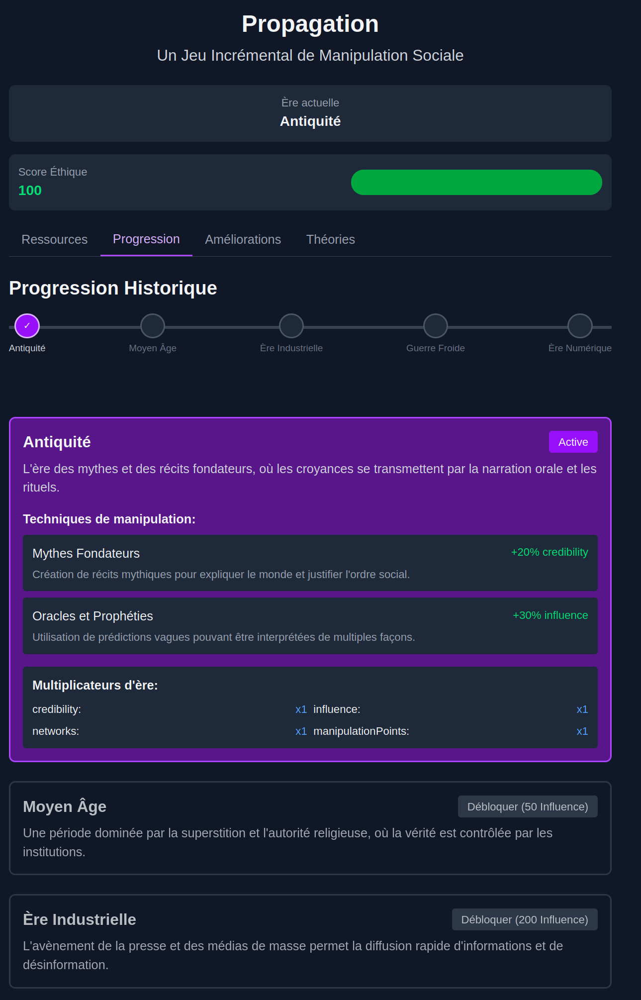

# 📢 PROPAGATION

<div align="center">
  
  
  
  **An incremental game about information, manipulation, and critical thinking**
  
  [Play Now](https://propagation.vercel.app) | [Learn More](#about-propagation) | [Development Log](log.md)
  
</div>

---

## 👁️ [Screenshot Gallery]

<div align="center">
  
  
  *Manipulate resources in different historical eras*
  
  
  *Choose between manipulation and revelation*
  
</div>

---

## 🌐 About Propagation

**Propagation** is not just another idle game. It's an interactive exploration of how information spreads, how beliefs form, and how manipulation works—across history and into the present day.

As you play, you'll progress through historical eras—from ancient myth-making to digital-age filter bubbles—mastering increasingly sophisticated techniques of influence while confronting profound ethical questions: 

**Will you manipulate or reveal? Mislead or enlighten?**

Your choices matter, not just for game progression, but as reflections on how information shapes our world.

> "The game that makes you question the games you play..."

## ✨ Key Features

### 🎮 Engaging Gameplay
- **Historical Progression** through five eras of information control
- **Resource Management** balancing credibility, influence, networks, and manipulation
- **Strategic Upgrades** specific to each historical context
- **Conspiracy Theories** to propagate (at your ethical peril)
- **Multiple Endings** based on your ethical choices

### 🧠 Meta-Gaming Elements
- Experience subtle **gaslighting mechanics** that blur the line between game and player
- Question your experiences as the game occasionally **breaks the fourth wall**
- Discover the game commenting on its own manipulative nature

### 🔄 Educational Approach
- Learn real historical **propaganda techniques** in context
- Experience firsthand the ethical tensions in information control
- Develop **critical thinking skills** applicable to modern media consumption

## 🔍 The Maieutic Approach

Propagation employs a **maieutic educational philosophy**—rather than telling you what to think, it creates conditions for you to discover insights through experience.

Like Socrates' method of helping others give birth to their own realizations, Propagation doesn't preach about misinformation. Instead, it puts you in the driver's seat of creating it, experiencing its effects, and confronting the consequences.

The game's systems are designed to trigger moments of reflection:

- "Wait, am I being manipulated by a game about manipulation?"
- "Why is spreading this conspiracy theory so effective yet troubling?"
- "How similar are these historical techniques to what I see online today?"

This approach creates deeper, more lasting understanding than didactic instruction ever could.

## 👥 Human × AI Collaboration

Propagation represents a new kind of creative partnership—a human-AI collaboration where:

- **Human direction** provided creative vision, ethical guardrails, and real-world context
- **AI implementation** delivered technical architecture, content generation, and system design

Rather than simply executing instructions, this project evolved through meaningful dialogue—iterative cycles of:

1. Human goal-setting and feedback
2. AI proposition and implementation
3. Collaborative refinement
4. Ethical reflection

The result is neither human nor AI work alone, but something genuinely emergent from the interaction of both intelligences.

## 🛠️ Tech Stack

- **React** + **Next.js** for frontend framework
- **TypeScript** for type safety
- **Tailwind CSS** for styling
- No backend required - runs entirely in browser with localStorage persistence

## 🚀 Getting Started

```bash
# Clone the repository
git clone https://github.com/yourusername/propagation.git

# Navigate to the project directory
cd propagation

# Install dependencies
npm install

# Start the development server
npm run dev
```

Then open [http://localhost:3000](http://localhost:3000) to see the game in action!

## 🤝 Credits

Propagation was created by:

- **Human Designer**: Creative direction, educational philosophy, ethical framework
- **Claude AI**: Code architecture, content generation, system implementation

*Special thanks to:*
- [Anthropic](https://anthropic.com) for developing Claude
- The rich academic literature on propaganda, media literacy, and critical thinking
- You, for playing and reflecting

---

<div align="center">
  <p><i>Remember: Question everything—including this game.</i></p>
  
  [](https://github.com/yourusername/propagation)
  [](https://reactjs.org/)
  [](https://anthropic.com)
  
</div>